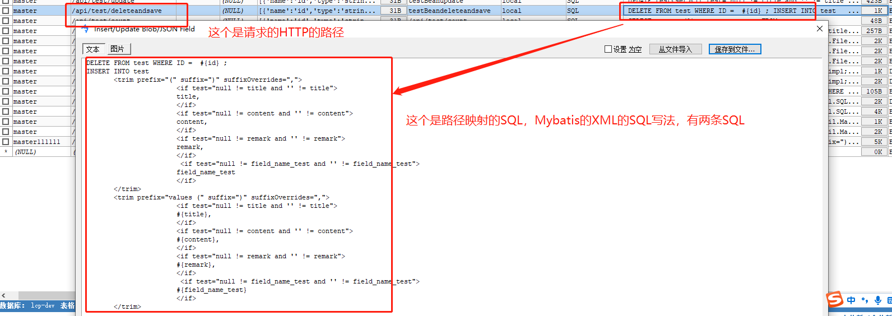
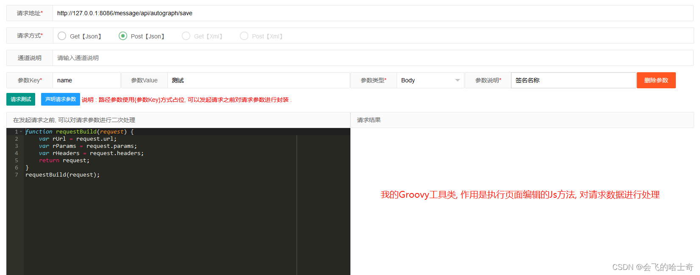
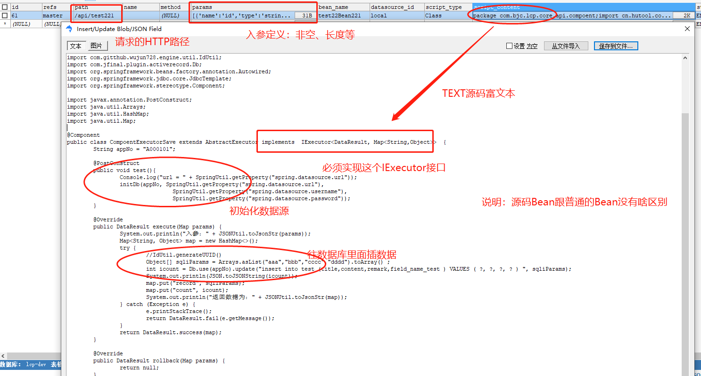
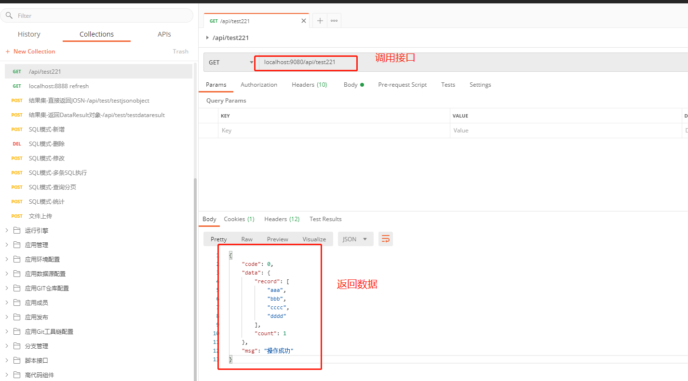
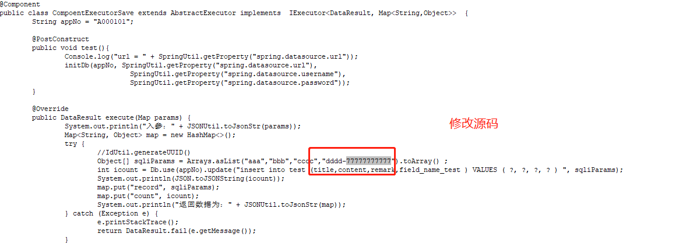

# jun-groovy-api-spring-boot-starter

jun-groovy-api-spring-boot-starter是低代码开发平台开发stater基座，基于SpringBoot项目都可以嵌入支持。项目基于SpringBoot+Groovy+SQL动态生成API并动态发布，且发布后可动态执行groovy脚本及SQL脚本的Stater。提供在线执行动态程序脚热加载本及动态生成API并执行的功能。支持动态注册Mapping，动态生成类及源码并动态编译生成Bean，**可动态生成HTTP接口。支持在线编辑写好SQL或者Java源码、Groovy源码、Python源码（TODO），JavaScript源码（TODO）、Shell脚本，后即可快速生成Rest接口对外提供服务**，同时支持服务在线热加载在线编辑替换逻辑，还将提供了一键生成CRUD通用接口方法，减少通用接口的SQL编写，让开发人员专注更复杂的业务逻辑实现。支持有JDBC驱动的的数据源(Java支持的都可以支持)。后续将集成微服务注册中心、网关支持接口转发、黑白名单、权限认证、限流、缓存、监控等提供一站式API服务功能。

说明：本项目仅是一个Stater，无法独立运行（通用模块），需要嵌入到jun_springboot_api_service中jun_springboot_groovy_api独立模块（定制模块）才能运行。

The project is based on SpringBoot+Groovy to dynamically generate APIs and publish them, and can dynamically execute Groovy scripts and SQL scripts' Staters after publication. Provide online execution of dynamic scripts class and hot loader and dynamic API generation and execution functions.


# 使用教程

- 在自己的maven项目中**引入maven坐标（已发布中央仓库）**
```xml
<dependency>
    <groupId>io.github.wujun728</groupId>
    <artifactId>jun-groovy-api-spring-boot-starter</artifactId>
    <version>1.0.2-RELEASE</version>
</dependency>
```

- 核心api - **Step1-加载源码生成类及SpringBean**
```
Class clazz = groovyClassLoader.parseClass(groovyInfo.getGroovyContent());
BeanDefinitionBuilder builder = BeanDefinitionBuilder.genericBeanDefinition(clazz);
BeanDefinition beanDefinition = builder.getBeanDefinition();
registry.registerBeanDefinition(groovyInfo.getBeanName(), beanDefinition);
```

- 核心api - **Step2-动态生成SpringMapping映射HTTP服务及接口（无需手写Mapping接口）**
```
// 取消历史注册
requestMappingHandlerMapping.unregisterMapping(mappingInfo);
// 重新注册mapping
requestMappingHandlerMapping.registerMapping(mappingInfo, mappingFactory, targetMethod);
}
```


- 核心api - **Step3-执行分N种实现，目前实现三种；SQL脚本模式、Java源码模式、Groovy源码**
Python源码（TODO），NodeJS源码（TODO），Shell(TODO)、PHP(TODO)、PowerShell(TODO)等类型脚本(JVM支持的都可以支持), 具体见注入mapping的method方法；
```
// 源码解析并执行
switch (config.getScriptType()) {
case "SQL":
	data = doSQLProcess(config, request, response);
	break;
case "Class":
	data = doGroovyProcess(config, request, response);
	break;
case "Groovy": 
	data = doGroovyProcess(config, request, response);
	break;
case "Jython": // TODO
	data = doPythonProcess(config, request, response);
	break; // TODO
case "Javascript": // TODO
	data = doNodeJSProcess(config, request, response);
case "Jruby":// TODO
	data = doRubyProcess(config, request, response);
	break;
default:
	break;
}

// SQL源码执行（SQL脚本支持mybatis写法及原生写法）
SqlMeta sqlMeta = JdbcUtil.getEngine().parse(apiSql.getSqlText(), sqlParam); 
Object data = JdbcUtil.executeSql(connection, sqlMeta.getSql(), sqlMeta.getJdbcParamValues());
dataList.add(data);

// Java源码执行（实现IExecutor接口，支持定制不同的接口，一般情况下也够用了）
String beanName = GroovyInnerCache.getByPath(config.getPath());//请求Path映射Bean名称
Map<String, Object> params = getParams(request, config);//获取Request参数转Map
IExecutor bean = SpringUtil.getBean(beanName);//调用Bean
return bean.execute(params);//返回Bean结果集

//其他源码执行（使用ScriptEngineManager来执行），举例JS如下，其他的还没来得及整,TODO中
ScriptEngineManager manager = new ScriptEngineManager();
ScriptEngine engine = manager.getEngineByName("javascript");
//向engine中存值
engine.put("str", "jsEnginePutTest");
engine.eval("var output ='' ;for (i = 0; i <= str.length; i++) {  output = str.charAt(i) + output }");     

```

# 示例

**Step1-启动的时候会读取api_config表中的记录并注册为Bean**

```

开始解析groovy脚本...
c.g.w.e.g.core.bean.GroovyDynamicLoader  : 当前groovyInfo加载完成,className-testdataresult,path-/api/test/testdataresult,beanName-testdataresult,BeanType-Class：
c.g.w.e.g.core.bean.GroovyDynamicLoader  : 当前groovyInfo加载完成,className-test22Bean1,path-/mobile/api/test22,beanName-test22Bean1,BeanType-Class：
结束解析groovy脚本...，耗时：1398

```

- **Step2，择取上面启动的两个示例：SQL示例（api_config里面插一条SQL类型的接口数据就可以了）**
### SQL开发及定义

**Step1，在数据库新增SQL接口**



**Step2，执行SQL接口**


**Step3、在线编辑接口及测试接口（TODO）**



#### Java源码接口开发

**Step1，在API_CONFIG表中新增一条数据映射成下面的类的解析，SQLyog数据及类的源码展示，具体如下**




**Step2，在POSTMAN中通过PATH，调用这个类，并Java源码解析后执行结果集返回的数据**



**Step3，不重启JVM，手动修改源码**（即使修改幅度非常大也没问题，只要能编译成功就可以）



**Step4，调用缓存刷新Refresh接口，重新初始化Bean及缓存**


**Step5，在POSTMAN中通过PATH，再次调用这个类，执行结果集返回的数据是最新编译的**

