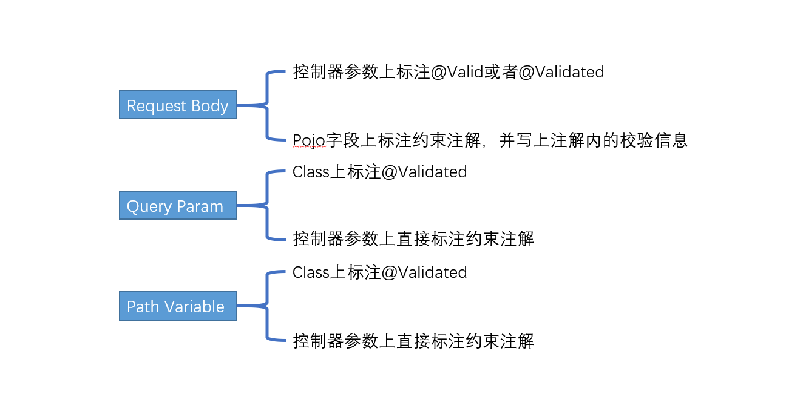
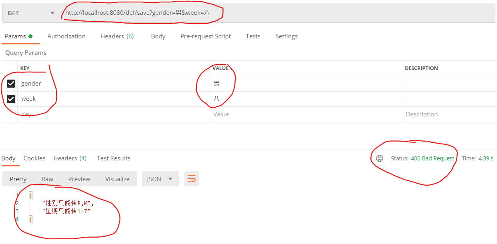

# hibernate-validator

### 一、概述

Bean Validation源于JSR-303 ，而JSR303是 Java EE 6 中的一项子规范。JSR349、JSR380是其升级版，添加了一些新的特性。Oracle公司传统艺能，一流公司定标准，它们只定义了一些校验注解（Constraint），如@Null@NotNull@Pattern]，位于javax.validation.constraints包下，只提供规范不提供实现。

Hibernate Validator是对这个规范的实现（不要和数据库ORM框架Hibernate联系在一起），并增加了一些自定义校验注解，如`@Email`、`@Length`、`@Range`，位于org.hibernate.validator.constraints包下。

这里贴上常用的注解和解释

| 注解                        | 释义                                                         |
| :-------------------------- | ------------------------------------------------------------ |
| @Null                       | 被注释的元素必须为 null                                      |
| @NotNull                    | 被注释的元素必须不为 null                                    |
| @AssertTrue                 | 被注释的元素必须为 true                                      |
| @AssertFalse                | 被注释的元素必须为 false                                     |
| @Min(value)                 | 被注释的元素必须是一个数字，其值必须大于等于指定的最小值     |
| @Max(value)                 | 被注释的元素必须是一个数字，其值必须小于等于指定的最大值     |
| @DecimalMin(value)          | 被注释的元素必须是一个数字，其值必须大于等于指定的最小值     |
| @DecimalMax(value)          | 被注释的元素必须是一个数字，其值必须小于等于指定的最大值     |
| @Size(max, min)             | 被注释的元素的大小必须在指定的范围内，元素必须为集合，代表集合个数 |
| @Digits (integer, fraction) | 被注释的元素必须是一个数字，其值必须在可接受的范围内         |
| @Past                       | 被注释的元素必须是一个过去的日期                             |
| @Future                     | 被注释的元素必须是一个将来的日期                             |
| @Email                      | 被注释的元素必须是电子邮箱地址                               |
| @Length(min=, max=)         | 被注释的字符串的大小必须在指定的范围内，必须为数组或者字符串，若微数组则表示为数组长度，字符串则表示为字符串长度 |
| @NotEmpty                   | 被注释的字符串的必须非空，**可以为空格，空字符串，null**     |
| @Range(min=, max=)          | 被注释的元素必须在合适的范围内                               |
| @NotBlank                   | 被注释的字符串的必须非空，**不可以为空格，可以为空字符串，null** |
| @Pattern(regexp = )         | 正则表达式校验                                               |

### 二、基础使用

在实际的web项目开发中，我们无需手动引入依赖。当依赖spring-boot-starter-web这个starter时，会自动传递相应的Bean Validation依赖。但有一点需要注意，在更新版本的SpringBoot中，默认移除了Bean Validtion相关依赖。具体的对应关系可以参照如下表格： 

| spring boot 版本 | validation依赖                             |
| ---------------- | ------------------------------------------ |
| < 2.3.x          | spring-boot-starter-web传递校验依赖        |
| > 2.3.x          | 需要手动引入spring-boot-starter-validation |

注：以下的示例代码是基于spring-boot 2.3.0.RELEASE版本

工程依赖文件如下

```xml
<dependencies>
        <dependency>
            <groupId>org.springframework.boot</groupId>
            <artifactId>spring-boot-starter-web</artifactId>
        </dependency>
        <dependency>
            <groupId>org.projectlombok</groupId>
            <artifactId>lombok</artifactId>
        </dependency>
        <dependency>
            <groupId>org.springframework.boot</groupId>
            <artifactId>spring-boot-starter-validation</artifactId>
        </dependency>
        <dependency>
            <groupId>org.springframework.boot</groupId>
            <artifactId>spring-boot-starter-test</artifactId>
            <scope>test</scope>
            <exclusions>
                <exclusion>
                    <groupId>org.junit.vintage</groupId>
                    <artifactId>junit-vintage-engine</artifactId>
                </exclusion>
            </exclusions>
        </dependency>
    </dependencies>
```

**Controller层校验**

假设我们实现了一个Spring REST控制器，想要验证由客户端传入的参数。根据请求方式、携带的内容以及实际应用场景，一般有三类：

- POST Request Body；

- GET PathVariable (如/foos/{id})；

- GET Query Param（如url?q=param）

上面三种基本覆盖了大部分的开发场景

 **1.验证Request Body** 

接收参数的包装类

```java
@Getter
@Setter
public class RequestParam {

    @Min(1)
    @Max(5)
    private Integer number;

    @Email
    private String email;
}
```

接收请求的controller

```java
@RestController
public class ValidateRequestBodyController {
    
    @PostMapping("/validateBody")
    public ResponseEntity<String> validateBody(@Valid @RequestBody RequestParam param) {
        return ResponseEntity.ok("valid");
    }
}
```

注意：此时注解标注的位置，**必须放在方法参数上**，放在类上会导致校验不生效，行为不符合预期。此外，针对这种情形`@Valid`和@`Validated`两个注解可以混用。 使用`@Validated`时也需要放在参数列表中，放在类上和放在方法上都会导致没有校验。

如果校验失败，会抛出一个**MethodArgumentNotValidException**异常，Spring默认会把这个转为400（Bad Request）请求。


请求：

```json
{
    "number":123456,
    "email":"123456@qq.com"
}
```

返回：

```json
{
    "timestamp": "2020-07-30T10:18:19.435+00:00",
    "status": 400,
    "error": "Bad Request",
    "message": "",
    "path": "/validateBody"
}
```

异常：

```text
org.springframework.web.bind.MethodArgumentNotValidException: Validation failed for argument [0]...
```

在实际项目开发中，通常会用 ExceptionHandler处理该异常，包裹返回一个更友好的提示：

定义全局异常处理器：

```java
@RestControllerAdvice
public class GlobalExceptionHandler {

    /**
     * 处理POST请求参数校验异常
     * @return
     */
    @ExceptionHandler(MethodArgumentNotValidException.class)
    public ResponseEntity<Map<String,Object>> validExceptionHandler(MethodArgumentNotValidException e) {
        List<FieldError> fieldErrors = e.getBindingResult().getFieldErrors();
        Map<String, Object> errorMap = fieldErrors.stream()
                .collect(Collectors.toMap(item -> item.getField(), item -> item.getDefaultMessage()));
        return ResponseEntity.badRequest().body(errorMap);
    }
}
```

再次请求

```json
#参数
{
    "number":123456,
    "email":"123456qq.com"
}
#结果
{
    "number": "最大值不能大于5",
    "email": "不是电子邮件格式"
}
```


 **2. 校验PathVariable/RequestParam** 

开发中，如果参数个数小于三个，倾向于不写Java Bean来封装参数，而是平铺写到方法入参中。对于这种情况，需要在入参上直接声明约束注解（如@Min())，并在类上标注`@Validated`注解。

 注意：在类级别上标注`@Validated`注解告诉Spring需要校验方法参数上的约束。 

接收请求的controller

```java
@RestController
@Validated // 告诉Spring校验方法参数上的约束
public class ValidateParametersController {

    /**
     * @param id
     * @return
     */
    @GetMapping("/validatePathVariable/{id}")
    public ResponseEntity<String> validatePathVariable(
            @PathVariable("id") @Min(value = 5,message = "id不能小于5") Integer id,
            @RequestParam("email") @Email(message = "邮箱格式不对") String email
    ) {
        return ResponseEntity.ok("valid");
    }
}

```

测试请求


异常信息

```json
javax.validation.ConstraintViolationException: validatePathVariable.email: 邮箱格式不对, validatePathVariable.id: id不能小于5
```

这是返回的状态码是：500，抛出的是**ConstraintViolationException**

在全局异常处理器中捕获该异常，处理该异常

```java
@ExceptionHandler(ConstraintViolationException.class)
public ResponseEntity<List<String>> constrainViolationHandler(ConstraintViolationException e){
      Set<ConstraintViolation<?>> violationSet = e.getConstraintViolations();
      List<String> errorList = violationSet.stream()
                .map(item -> item.getMessage()).collect(Collectors.toList());
      return ResponseEntity.badRequest().body(errorList);
}
```

再次请求：


**注意：这种情况你要是把注解`@Valid`或者`@Validated`标注在方法或者参数列表中，都不会校验。**

总结一下：



### 三、嵌套校验

上文提到过针对Java Bean的校验，里面的字段都是非嵌套。实际的业务场景中，对象内字段类型也是对象的场景并不罕见。 

**正确使用示例：**

```java
@Data
public class Input {

    @NotBlank
    private String path;

    @Valid //这个注解不加就不会校验Person里面的约束
    private Person person;
}

@Data
class Person{

    @NotBlank
    private String name;
    @Positive // 正数
    private Integer age;
}
```

可以看到此处的 Input有一个 person字段，该字段指向另一个Java Bean。针对这种场景，需要在person字段上标注`@Valid`注解，并且该字段指向的类同样需要标注约束注解。 

**controller**

```java
@RestController()
@RequestMapping("/nest")
public class NestValidateController {

    @PostMapping("/validate")
    public ResponseEntity<String> validateNestingAttr(@Valid @RequestBody Input input) {
        return ResponseEntity.ok("valid");
    }
}
```

**注意：**此时用`@Valid`和`@Validated`都可以，总结一下：在使用@RequestBody接收json数据时，必须在方法的参数列表里面使用`@Valid`或`@Validated`来告诉**hibernate-validator**需要校验参数封装实体的字段约束(被标注到字段上的校验注解),然后在需要嵌套校验的字段上标注@Valid注解，因为@Validated是不能使用在类的字段上的，所以只能使用@Valid


### 四、分组校验

通常，某些Java Bean在不同的请求之间共享。以典型的CRUD操作为例：Create请求和Update请求很可能都采用相同的对象类型作为输入。但是，在不同的情况下可能会触发不同的验证。 

**正确使用的示例：**

```java
@Data
public class User {

    @NotNull(groups = OnUpdate.class)
    @Null(groups = OnCreate.class)
    private Long id;

    @NotEmpty(groups = OnCreate.class)
    private String userName;

    @NotEmpty(groups = OnCreate.class)
    private String mobile;

    // 仅仅作为一个标记接口
    public interface OnUpdate{}

    public interface OnCreate{}
}

```

三个字段标明在创建操作时需要校验

**controller**

```java
@RestController
@RequestMapping("/group")
public class GroupValidateController {
    
    @PostMapping("/user")
    public ResponseEntity<String> save(@Validated(value = {User.OnCreate.class}) @RequestBody User user) {
        return ResponseEntity.ok("valid");
    }
}

```

方法参数中标明需要校验的分组

只有`@Validated`才支持分组校验，所以这里必须使用@Validated，不能用@Valid替换

此时生效的是：**@Null(groups = OnCreate.class)**，id必须为空，userName和mobile不能为空


### 五、自定义校验

有时官方提供的注解规则不能满足我们的需要，这时就要自定义注解来自定义校验规则，举一个典型的应用场景，只接收给定的字符，其它字符都校验不通过。比如：性别只接收 M，F；

**1.定义一个注解**

```java
/**
 * @Constraint: 关联解析类
 * @Target: 注解作用于的位置
 */
@Constraint(validatedBy = EnumValueValidator.class)
@Target({ElementType.FIELD,ElementType.PARAMETER,ElementType.METHOD})
@Retention(RetentionPolicy.RUNTIME)
public @interface EnumValue {

    String[] value() default "";

    String message() default "参数必须为指定的值";

    Class<?>[] groups() default {};

    Class<? extends javax.validation.Payload>[] payload() default {};
}
```

**2.定义校验的规则**

```java
public class EnumValueValidator implements ConstraintValidator<EnumValue,String> {

    private String[] enumValue;

    /**
     * 初始化时把注解中的值传过来
     * @param constraintAnnotation
     */
    @Override
    public void initialize(EnumValue constraintAnnotation) {
        this.enumValue = constraintAnnotation.value();
    }

    /**
     *
     * @param source 是要被校验的值
     * @param context
     * @return
     */
    @Override
    public boolean isValid(String source, ConstraintValidatorContext context) {
        if(source instanceof String) {
            for (String val : enumValue) {
                if(val.equals(source)) {
                    return true;
                }
            }
        }else {
            throw new IllegalArgumentException("参数类型非法");
        }
        return false;
    }
}

```

**3.controller中使用**

```java
@RestController
@RequestMapping("/def")
@Validated // 这个注解一定不能忘
public class DefinationValidator {

    @GetMapping("/save")
    public ResponseEntity<String> save(
            @EnumValue(value = {"F","M"},message = "性别只能传F,M")
            @RequestParam("gender") String gender,
            @EnumValue(value = {"1","2","3","4","5","6","7"},message = "星期只能传1-7")
            @RequestParam("week") String week
    ) {
        return ResponseEntity.ok("valid");
    }
}
```

**4.测试**



