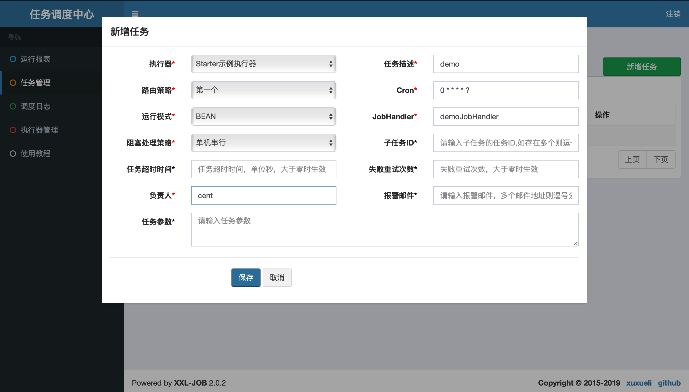
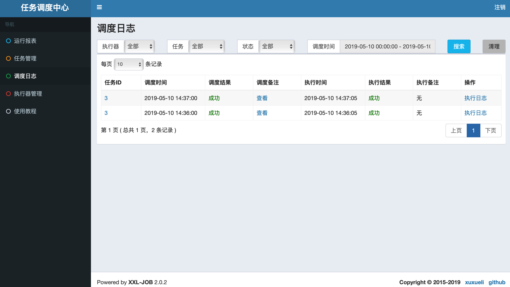
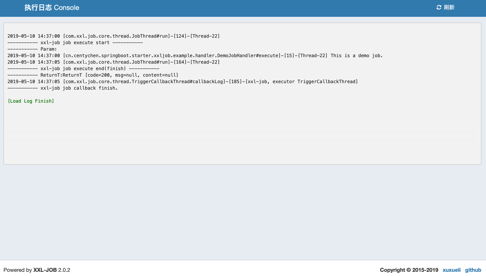

# xxl-job-spring-boot-starter

# 简述
本项目将xxl-job-core包简单封装成spring boot starter，方便通过Spring Boot方式开发xxl-job的executor

# 使用方法
## 添加依赖
创建一个Spring Boot项目
- 添加依赖包
```
<dependency>
    <groupId>org.springframework.boot</groupId>
    <artifactId>spring-boot-starter-web</artifactId>
    <version>2.1.4.RELEASE</version>
    <exclusions>
        <!-- exclude tomcat -->
        <exclusion>
            <groupId>org.springframework.boot</groupId>
            <artifactId>spring-boot-starter-tomcat</artifactId>
        </exclusion>
    </exclusions>
</dependency>
<dependency>
    <groupId>org.springframework.boot</groupId>
    <artifactId>spring-boot-starter-undertow</artifactId>
    <version>2.1.4.RELEASE</version>
</dependency>

<dependency>
    <groupId>cn.centychen</groupId>
    <artifactId>xxl-job-spring-boot-starter</artifactId>
    <version>1.0.1-RELEASE</version>
</dependency>

```

## 修改xxl-job配置
添加以下xxl-job配置，也可不配置，不配置则使用默认值。
```
xxl-job:
  admin:
    admin-addresses: http://localhost:8080/xxl-job-admin
  executor:
    app-name: xxl-job-spring-boot-starter-example #默认为 xxl-job-executor
    access-token: #默认为空
    log-path: logs/applogs/xxl-job/jobhandler #默认为 logs/applogs/xxl-job/jobhandler
    log-retention-days: 10 #默认为 10
    ip: #默认为空
    port: 9999 #默认为 9999
```

## 编写任务处理器
创建DemoJobHandler.class类，继承IJobHandler抽象类，示例代码如下：
```
import com.xxl.job.core.biz.model.ReturnT;
import com.xxl.job.core.handler.IJobHandler;
import com.xxl.job.core.handler.annotation.JobHandler;
import com.xxl.job.core.log.XxlJobLogger;
import org.springframework.stereotype.Component;

@JobHandler("demoJobHandler")
@Component
public class DemoJobHandler extends IJobHandler {

    @Override
    public ReturnT<String> execute(String s) throws Exception {
        XxlJobLogger.log("This is a demo job.");
        Thread.sleep(5 * 1000L);
        return SUCCESS;
    }
}
```

## 启动测试
### 添加执行器
在调度中心->执行器管理中增加执行器。


### 启动执行器
- 启动示例执行器服务，启动成功log如下：
```

  .   ____          _            __ _ _
 /\\ / ___'_ __ _ _(_)_ __  __ _ \ \ \ \
( ( )\___ | '_ | '_| | '_ \/ _` | \ \ \ \
 \\/  ___)| |_)| | | | | || (_| |  ) ) ) )
  '  |____| .__|_| |_|_| |_\__, | / / / /
 =========|_|==============|___/=/_/_/_/
 :: Spring Boot ::        (v2.1.4.RELEASE)

2019-05-10 14:26:16.523  INFO 1444 --- [           main] c.c.s.s.xxljob.example.Application       : Starting Application on centdeMacBook-Pro.local with PID 1444 (/Users/cent/source-java/xxl-job-spring-boot-starter-example/target/classes started by cent in /Users/cent/source-java/xxl-job-spring-boot-starter-example)
2019-05-10 14:26:16.532  INFO 1444 --- [           main] c.c.s.s.xxljob.example.Application       : No active profile set, falling back to default profiles: default
2019-05-10 14:26:19.039  WARN 1444 --- [           main] io.undertow.websockets.jsr               : UT026010: Buffer pool was not set on WebSocketDeploymentInfo, the default pool will be used
2019-05-10 14:26:19.067  INFO 1444 --- [           main] io.undertow.servlet                      : Initializing Spring embedded WebApplicationContext
2019-05-10 14:26:19.067  INFO 1444 --- [           main] o.s.web.context.ContextLoader            : Root WebApplicationContext: initialization completed in 1641 ms
2019-05-10 14:26:19.351  INFO 1444 --- [           main] o.s.s.concurrent.ThreadPoolTaskExecutor  : Initializing ExecutorService 'applicationTaskExecutor'
2019-05-10 14:26:19.483  INFO 1444 --- [           main] c.c.s.s.x.a.XxlJobAutoConfiguration      : >>>>>>>>>>> xxl job config init...
2019-05-10 14:26:19.490  INFO 1444 --- [           main] c.xxl.job.core.executor.XxlJobExecutor   : >>>>>>>>>>> xxl-job register jobhandler success, name:demoJobHandler, jobHandler:cn.centychen.springboot.starter.xxljob.example.handler.DemoJobHandler@660f0c
2019-05-10 14:26:19.543  INFO 1444 --- [           main] c.x.r.r.provider.XxlRpcProviderFactory   : >>>>>>>>>>> xxl-rpc, provider factory add service success. serviceKey = com.xxl.job.core.biz.ExecutorBiz, serviceBean = class com.xxl.job.core.biz.impl.ExecutorBizImpl
2019-05-10 14:26:19.699  INFO 1444 --- [           main] org.xnio                                 : XNIO version 3.3.8.Final
2019-05-10 14:26:19.714  INFO 1444 --- [           main] org.xnio.nio                             : XNIO NIO Implementation Version 3.3.8.Final
2019-05-10 14:26:19.809  INFO 1444 --- [           main] o.s.b.w.e.u.UndertowServletWebServer     : Undertow started on port(s) 8080 (http) with context path ''
2019-05-10 14:26:19.814  INFO 1444 --- [           main] c.c.s.s.xxljob.example.Application       : Started Application in 4.35 seconds (JVM running for 6.302)
2019-05-10 14:26:19.831  INFO 1444 --- [      Thread-14] com.xxl.rpc.remoting.net.Server          : >>>>>>>>>>> xxl-rpc remoting server start success, nettype = com.xxl.rpc.remoting.net.impl.netty_http.server.NettyHttpServer, port = 9999
```
- 执行器启动成功后，在调度中心的执行器记录中可以查看到注册信息。


### 添加调度任务
在调度中心->任务管理中添加一个调度任务，配置如下图：


### 执行调度任务
启动调度任务，查看调度日志。




# 示例源码
- 码云：[centychen/xxl-job-spring-boot-starter-example](https://gitee.com/centy/xxl-job-spring-boot-starter-example.git)